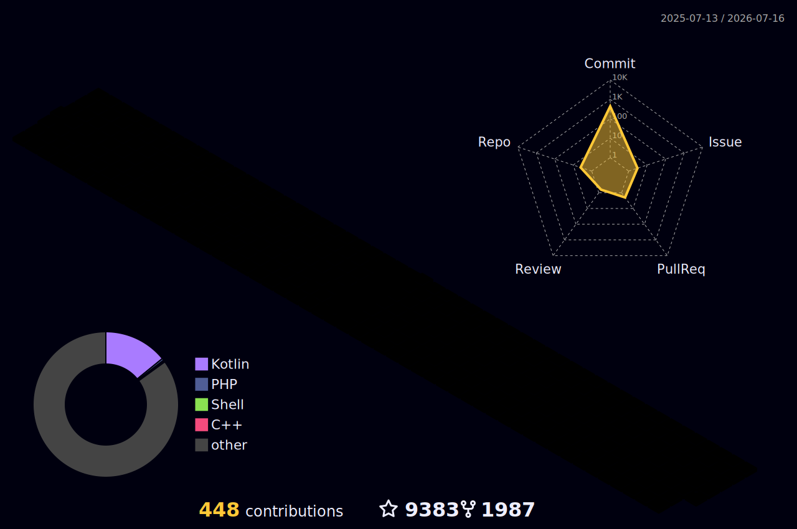

### Hi I'm FranzKafkaYu 👋

<!--
**FranzKafkaYu/FranzKafkaYu** is a ✨ _special_ ✨ repository because its `README.md` (this file) appears on your GitHub profile.

Here are some ideas to get you started:

-->

## ⚡ Platforms

## ⚡ Tec Stacks

## 🌎 Find me  
- 邮箱:<a href="mailto:loveme@duck.com">loveme@duck.com</a>:e-mail:
- 博客: click [FranzKafkaBlog](https://blog.coderfan.org):memo:
- 
- 微信公众号: 搜索 **Xndroid**✍🏾
## 🚀 Blog Posts
<!-- BLOG-POST-LIST:START -->
- [搬瓦工服务器母公司最新推出服务Pathfabric使用指南](https://blog.coderfan.org/bandwagonhost-new-service-pathfabric-user-guide.html?utm_source=rss&utm_medium=rss&utm_campaign=bandwagonhost-new-service-pathfabric-user-guide)
- [安卓系统中基于tinyALSA实现音频播放与获取](https://blog.coderfan.org/audio-play-and-audio-record-in-android-based-on-tinyalsa.html?utm_source=rss&utm_medium=rss&utm_campaign=audio-play-and-audio-record-in-android-based-on-tinyalsa)
- [OpenHarmony系统服务框架SAMGR解析](https://blog.coderfan.org/openharmony-service-manageent-framework-samgr.html?utm_source=rss&utm_medium=rss&utm_campaign=openharmony-service-manageent-framework-samgr)
- [基于OpenSpec的SDD Vibe Coding实践](https://blog.coderfan.org/%e5%9f%ba%e4%ba%8eopenspec%e7%9a%84sdd-vibe-coding%e5%ae%9e%e8%b7%b5.html?utm_source=rss&utm_medium=rss&utm_campaign=%25e5%259f%25ba%25e4%25ba%258eopenspec%25e7%259a%2584sdd-vibe-coding%25e5%25ae%259e%25e8%25b7%25b5)
- [Github Action中安全配置安卓证书签名](https://blog.coderfan.org/sign-configuration-for-release-android-application-in-github-action.html?utm_source=rss&utm_medium=rss&utm_campaign=sign-configuration-for-release-android-application-in-github-action)
<!-- BLOG-POST-LIST:END -->

## 🌎 Visitors

