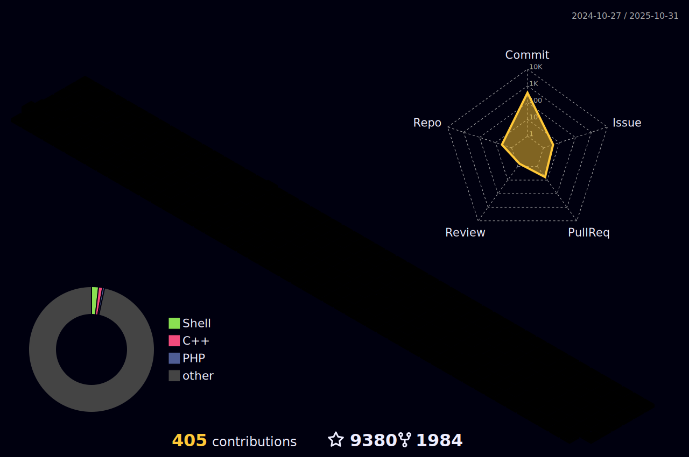

### Hi I'm FranzKafkaYu 👋

<!--
**FranzKafkaYu/FranzKafkaYu** is a ✨ _special_ ✨ repository because its `README.md` (this file) appears on your GitHub profile.

Here are some ideas to get you started:

-->

## ⚡ Platforms

## ⚡ Tec Stacks

  

## 🌎 Find me
- wechat Official Account: search **语如鲸落**📹 ✍🏾
- blog: click [FranzKafkaBlog](https://coderfan.net/)🏓
## 🚀 Blog Posts
<!-- BLOG-POST-LIST:START -->
- [Golang编译优化之静态链接](https://coderfan.net/optimization-golang-compilation-with-statically-linked.html?utm_source=rss&utm_medium=rss&utm_campaign=optimization-golang-compilation-with-statically-linked)
- [X-UI面板进阶使用：更快、更安全、更稳定](https://coderfan.net/x-ui-usage-enhancment-for-better-enhancement.html?utm_source=rss&utm_medium=rss&utm_campaign=x-ui-usage-enhancment-for-better-enhancement)
- [Linux系统调用epoll与select使用详解](https://coderfan.net/epoll-and-select-usage-in-linux-system.html?utm_source=rss&utm_medium=rss&utm_campaign=epoll-and-select-usage-in-linux-system)
- [一文教你如何做出好看又帅气的GitHub主页](https://coderfan.net/how-to-make-your-own-beautiful-github-overview.html?utm_source=rss&utm_medium=rss&utm_campaign=how-to-make-your-own-beautiful-github-overview)
- [Android系统rc启动文件解析](https://coderfan.net/rc-init-files-in-android-system.html?utm_source=rss&utm_medium=rss&utm_campaign=rc-init-files-in-android-system)
<!-- BLOG-POST-LIST:END -->

## 🌎 Visitors

